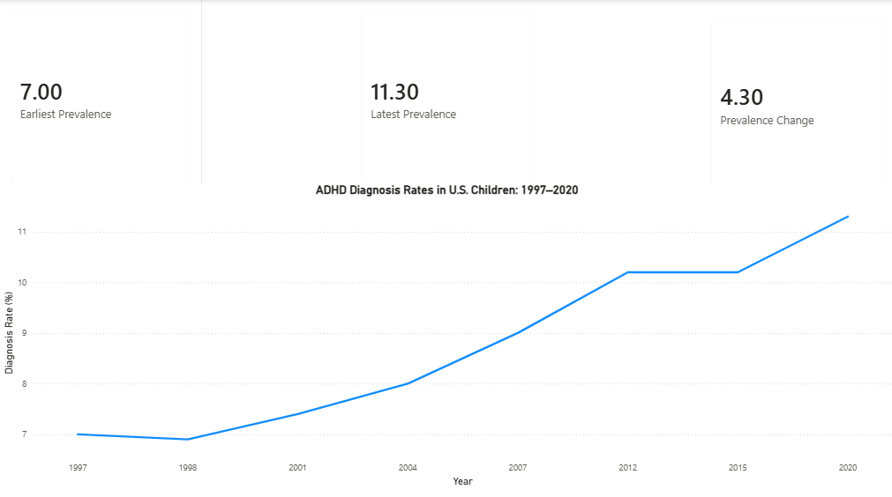
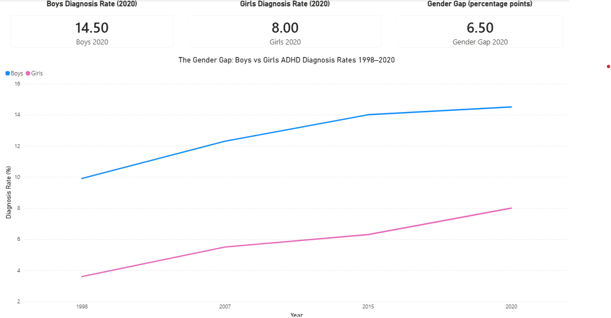
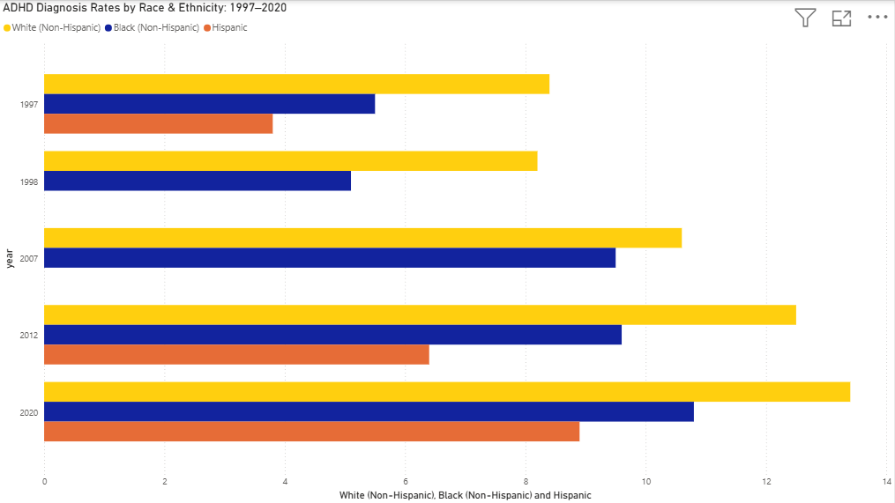
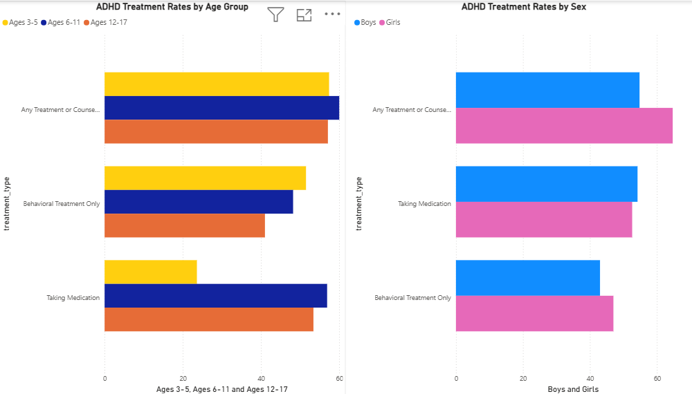
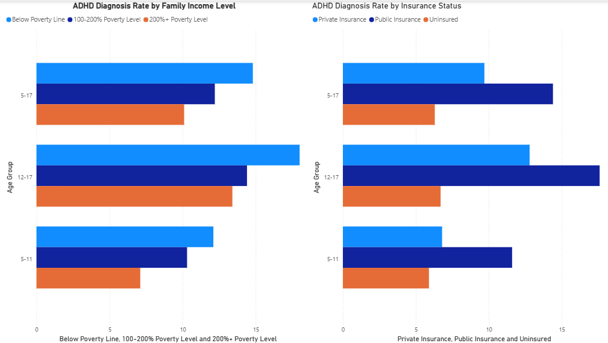

# 🧠 ADHD in America: A 25-Year Analysis
### Public Health Analytics Series — Project 1 of 3 | Tools: Python, SQLite, Power BI

A data-driven investigation into the rise of ADHD diagnoses in U.S. children from 1997 to 2022. This project analyzes over two decades of CDC National Health Interview Survey (NHIS) data to uncover trends in diagnosis rates, demographic disparities, treatment gaps, and the role of socioeconomic factors in who gets diagnosed — and who doesn't.

---

## 📁 Project Structure

```
adhd-in-america/
│
├── csv/                        # Source data files
│   ├── adhd_prevalence_historical.csv
│   ├── adhd_by_income_insurance.csv
│   ├── Treatment of ADHD by Age.csv
│   ├── Treatment of ADHD by Sex.csv
│   ├── Other Concerns and Conditions with ADHD by Age.csv
│   └── Other Concerns and Conditions with ADHD by Sex.csv
│
├── screenshots/                # Dashboard page screenshots
│   ├── adhd_overview.png
│   ├── adhd_gender_gap.png
│   ├── adhd_equity.png
│   ├── adhd_medication.png
│   └── adhd_socioeconomic.png
│
├── adhd_etl.py                 # Python ETL script
├── adhd_america.db             # SQLite database
└── ADHD in America.pbix        # Power BI dashboard
```

---

## 📊 Data Sources

All data sourced from official U.S. government publications — no paywalls, no applications required.

| Source | Coverage | What It Provides |
|--------|----------|-----------------|
| CDC NCHS Data Brief No. 70 | 1998–2009 | Prevalence by year, sex, race, income, region |
| CDC NCHS Data Brief No. 499 | 2020–2022 | Prevalence by sex, race, income, insurance status |
| CDC MMWR QuickStats | 1997–2014 | Longitudinal prevalence snapshots |
| CDC ADHD Data Hub | 2022 snapshot | Treatment rates, co-occurring conditions |

---

## 🔧 Tools & Workflow

**Python** → data loading, cleaning, standardization, SQLite export

**SQLite** → structured storage and SQL analysis queries

**Power BI** → 5-page interactive dashboard

---

## 🗄️ Database Schema

Six tables loaded into `adhd_america.db`:

| Table | Description |
|-------|-------------|
| `prevalence_historical` | Year-over-year diagnosis rates 1997–2022 with demographic breakdowns |
| `income_insurance` | Diagnosis rates by family income level and insurance status |
| `treatment_by_age` | Medication and behavioral treatment rates by age group |
| `treatment_by_sex` | Medication and behavioral treatment rates by sex |
| `conditions_by_age` | Co-occurring conditions (anxiety, depression, ASD, etc.) by age |
| `conditions_by_sex` | Co-occurring conditions by sex |

---

## 🔍 SQL Analysis

### The 25-Year Trend
```sql
SELECT 
    year,
    period,
    overall_pct,
    boys_pct,
    girls_pct
FROM prevalence_historical
ORDER BY year;
```

### Race & Ethnicity Disparities
```sql
SELECT
    year,
    period,
    overall_pct,
    white_nonhispanic_pct,
    black_nonhispanic_pct,
    hispanic_pct
FROM prevalence_historical
WHERE white_nonhispanic_pct IS NOT NULL
   OR black_nonhispanic_pct IS NOT NULL
   OR hispanic_pct IS NOT NULL
ORDER BY year;
```

### Socioeconomic & Insurance Gaps
```sql
SELECT
    period,
    age_group,
    income_below_100fpl_pct,
    income_100_200fpl_pct,
    income_200plus_fpl_pct,
    insured_private_pct,
    insured_public_pct,
    uninsured_pct
FROM income_insurance
ORDER BY period, age_group;
```

---

## 📈 Dashboard — Page by Page

### Page 1 — Overview


ADHD diagnoses in U.S. children climbed from **7.0% in 1997 to 11.3% in 2020** — a 61% increase over 25 years. The trend line shows steady growth across every measured period with no signs of leveling off.

🔎 **Key Finding:** The overall diagnosis rate increased by 4.3 percentage points over 25 years, representing millions of additional children entering the healthcare system for ADHD evaluation and treatment.

---

### Page 2 — The Gender Gap


Boys have been diagnosed at roughly twice the rate of girls throughout the entire 25-year period. However, the gap is measurably narrowing — girls' diagnosis rates more than doubled from 3.6% to 8.0% while boys rose from 9.9% to 14.5%.

🔎 **Key Finding:** The gender gap shrank from **6.3 percentage points in 1998 to 6.5 in 2020** — but girls' rate of growth outpaced boys significantly, suggesting increasing clinical awareness of how ADHD presents differently in females.

---

### Page 3 — The Equity Problem


White non-Hispanic children have been diagnosed at consistently higher rates than Black and Hispanic children across all measured years. By 2020, White children (13.4%) were diagnosed at a rate **4.5 points higher** than Hispanic children (8.9%).

🔎 **Key Finding:** The gap between Black and White children narrowed substantially — from 3.1 points in 1997 to just 2.6 points in 2020. The Hispanic diagnosis rate, while growing, remains the lowest of all three groups — raising important questions about healthcare access, language barriers, and diagnostic bias rather than true differences in prevalence.

---

### Page 4 — The Medication Question


Only **23.6% of children ages 3–5** with ADHD are currently taking medication — compared to 56.9% of children ages 6–11 and 53.4% of teens. Behavioral treatment fills much of that gap for younger children (51.5%).

🔎 **Key Finding:** Girls receive significantly more behavioral and counseling treatment than boys (64.7% vs 54.8%) despite being diagnosed at lower rates. Boys and girls are medicated at nearly identical rates (54.2% vs 52.6%), suggesting treatment approaches diverge meaningfully by sex beyond medication alone.

---

### Page 5 — The Socioeconomic Story


Children living below the federal poverty line are diagnosed at **14.8%** — nearly 5 points higher than children in households at 200%+ of the poverty level (10.1%). The pattern holds across all age groups and intensifies in the 12–17 range.

🔎 **Key Finding:** Uninsured children show the **lowest diagnosis rate at just 6.3%** — not because they have less ADHD, but almost certainly because they lack access to the healthcare system that produces diagnoses. Children with public insurance are diagnosed at 14.4%, higher than privately insured children (9.7%), reflecting the concentration of ADHD in lower-income households.

---

## 💡 Key Takeaways

- ADHD diagnoses increased **61%** over 25 years — from 7.0% to 11.3% of U.S. children
- The **gender gap is narrowing** as awareness of female ADHD presentations grows
- **Hispanic and uninsured children** are likely underdiagnosed due to access barriers, not lower prevalence
- Only **1 in 4 toddlers** with ADHD receives medication — behavioral treatment is the primary approach for the youngest children
- **Poverty correlates with higher diagnosis rates** but insurance status reveals the access paradox — uninsured children show the lowest rates despite likely higher need

---

## 🗂️ Portfolio Navigation — Public Health Analytics Series

| # | Project | Tools |
|---|---------|-------|
| **1** | **ADHD in America: A 25-Year Analysis** | **Python, SQLite, Power BI** |
| 2 | [The Opioid Crisis: A 25-Year Analysis](https://github.com/brycegardner90/opioid-crisis-analysis) | Python, SQLite, Power BI |
| 3 | [Mental Health in America: Trends & Treatment Gaps](https://github.com/brycegardner90/mental-health-trends) | Python, SQLite, Power BI |
